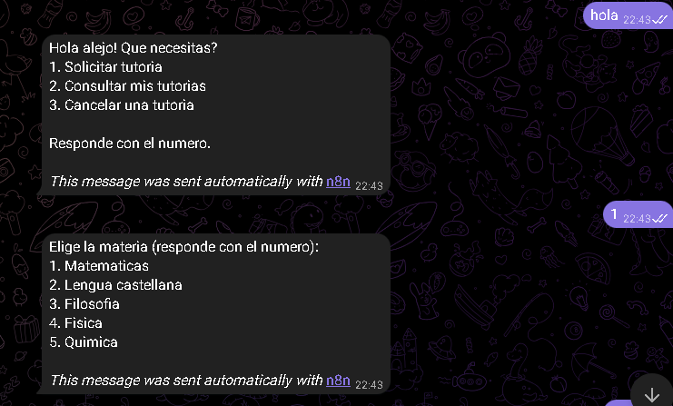
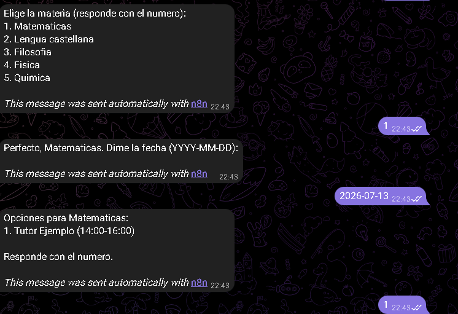
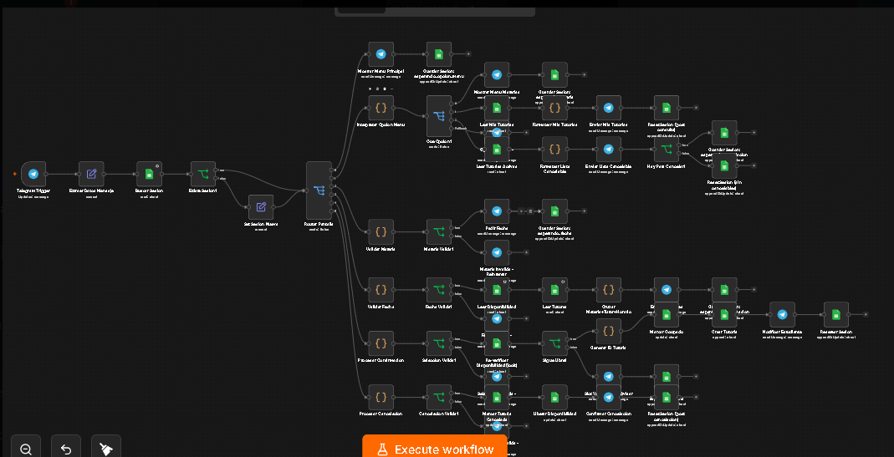

# TutorBot 🎓 — Bot de Tutorías por Telegram (n8n + Google Sheets)

Bot de Telegram para que estudiantes soliciten, consulten y cancelen tutorías, construido como un workflow de **n8n** que usa **Google Sheets** como base de datos. La sesión de cada usuario se guarda en la hoja `SESSIONS`, así que la conversación se mantiene como una máquina de estados: cada mensaje entrante se interpreta según la "pantalla" en la que el usuario se quedó la última vez.

## Captura del bot funcionando

| Menú principal | Flujo de solicitud de tutoría |
|---|---|
|  |  |

El usuario escribe un número para navegar el menú, elige materia, escribe la fecha en formato `YYYY-MM-DD` y el bot cruza esa fecha/materia contra la disponibilidad real de los tutores antes de confirmar.

## Diagrama del workflow



## Archivos incluidos

| Archivo | Descripción |
|---|---|
| `TutorBot_-_Bot_ESTUDIANTES.json` | **Workflow principal (el que corresponde a las capturas de arriba).** Implementación "pantalla por pantalla": cada paso de la conversación es un nodo o grupo de nodos propio dentro de n8n (mostrar menú, guardar sesión, validar materia, validar fecha, cruzar disponibilidad, confirmar, etc.). 55 nodos. |
| `TutorBot_workflow.json` | Versión alternativa/más compacta del mismo bot, con la lógica conversacional centralizada en un único nodo de Código llamado **"Motor de Estado"** en vez de repartirla en nodos individuales por pantalla. Útil como referencia de arquitectura más liviana. 17 nodos. |

> Ambos archivos son exports de n8n (`.json`) listos para importar vía *Import from File* en el editor de n8n.

---

## 1. Arquitectura general

```
Telegram Trigger
      │
Extraer Datos Mensaje (chat_id, texto, nombre)
      │
Buscar Sesión (Google Sheets → SESSIONS, filtra por telegram_user)
      │
¿Existe Sesión? ──No──> Set Sesión Nueva (pantalla_actual = "menu_principal")
      │Sí
      ▼
Router Pantalla (Switch por pantalla_actual)
      │
      ├─ menu_principal          → muestra menú, guarda pantalla = esperando_opcion_menu
      ├─ esperando_opcion_menu   → interpreta 1/2/3 → solicitar | consultar | cancelar
      ├─ esperando_materia       → valida materia, pide fecha
      ├─ esperando_fecha         → valida fecha, cruza con Disponibilidad + Tutores
      ├─ esperando_confirmacion  → re-verifica el cupo (lock), crea la tutoría
      └─ esperando_cancelacion   → cancela y libera el cupo en Disponibilidad
```

Cada respuesta del bot termina guardando (o reseteando) el campo `pantalla_actual` en `SESSIONS`, de modo que el **próximo mensaje del usuario se interpreta según en qué pantalla se quedó**, sin necesidad de un backend con estado en memoria.

## 2. Estructura de Google Sheets

El spreadsheet tiene 5 hojas (tabs):

### `SESSIONS`
Guarda el estado conversacional de cada usuario.
| Columna | Uso |
|---|---|
| `telegram_user` | chat_id de Telegram, clave de búsqueda |
| `pantalla_actual` | estado actual: `menu_principal`, `esperando_opcion_menu`, `esperando_materia`, `esperando_fecha`, `esperando_confirmacion`, `esperando_cancelacion` |
| `datos_parciales` | JSON serializado con lo que el usuario ya eligió (materia, fecha, opciones mostradas, etc.) mientras completa un flujo |

### `TUTORES`
| Columna | Uso |
|---|---|
| `id_tutor` | ID del tutor |
| `nombre` | Nombre a mostrar |
| `especialidad_materias` | Lista de materias separadas por coma, se usa para el match |

### `DISPONIBILIDAD`
| Columna | Uso |
|---|---|
| `id_dispo` | ID del slot |
| `id_tutor` | Tutor dueño del slot |
| `dia_semana` | Día |
| `hora_inicio` / `hora_fin` | Rango horario |
| `estado` | `Libre` / `Ocupado` |
| `id_tutoria_asociada` | Se llena cuando el slot queda tomado |

### `TUTORIAS`
| Columna | Uso |
|---|---|
| `id_tutoria` | ID generado como `TUT-<timestamp>` |
| `id_estudiante` | chat_id del estudiante |
| `id_tutor` | tutor asignado |
| `materia`, `fecha`, `hora` | datos de la sesión agendada |
| `estado` | `Asignada` / `Confirmada` / `Cancelada` |
| `timestamp_creacion` | fecha de creación del registro |

### `ESTUDIANTES`
Catálogo de estudiantes registrados (usada en el flujo de registro de la versión "Motor de Estado"; en el export de `Bot_ESTUDIANTES.json` que corresponde a las capturas, este flujo aún no está conectado — ver sección de pendientes).

## 3. Flujos implementados (`TutorBot_-_Bot_ESTUDIANTES.json`)

### 3.1 Menú principal
Muestra las 3 opciones (solicitar / consultar / cancelar) y guarda `pantalla_actual = esperando_opcion_menu`. Si el usuario responde algo distinto de `1`, `2` o `3`, se le vuelve a pedir.

### 3.2 Solicitar tutoría
1. Pide la materia (lista fija: Matemáticas, Lengua castellana, Filosofía, Física, Química) y valida el número recibido.
2. Pide la fecha en formato `YYYY-MM-DD`, valida formato y que no sea una fecha pasada.
3. Cruza `DISPONIBILIDAD` × `TUTORES` filtrando por especialidad de materia, y arma la lista de horarios libres para esa fecha.
4. El estudiante elige un número de la lista → **se re-verifica la disponibilidad** (lock) por si otro estudiante tomó el cupo mientras tanto.
5. Si sigue libre: genera `id_tutoria`, marca el slot como `Ocupado` en `DISPONIBILIDAD`, crea el registro en `TUTORIAS` y notifica al estudiante.
6. Si ya lo tomaron: avisa y devuelve al usuario a `esperando_fecha` para que intente otro horario.

### 3.3 Consultar mis tutorías
Lee `TUTORIAS` filtrando por el `telegram_user`, formatea la lista (materia, fecha, hora, estado) y resetea la sesión al final.

### 3.4 Cancelar una tutoría
Lee las tutorías del usuario con estado `Asignada` o `Confirmada`, muestra una lista numerada para elegir cuál cancelar, marca esa tutoría como `Cancelada` en `TUTORIAS`, libera el slot correspondiente en `DISPONIBILIDAD` (vuelve a `Libre`) y confirma al estudiante.

## 4. Requisitos para desplegarlo

- Una instancia de **n8n** (cloud o self-hosted).
- Credenciales de **Telegram** (Bot Token vía [@BotFather](https://t.me/BotFather)) conectadas al nodo `Telegram Trigger` / nodos de envío.
- Credenciales de **Google Sheets OAuth2** con acceso al spreadsheet.
- Un Google Sheet con las 5 hojas descritas arriba (`SESSIONS`, `TUTORES`, `DISPONIBILIDAD`, `TUTORIAS`, `ESTUDIANTES`) y sus columnas correspondientes.

### Pasos
1. Importar el archivo `TutorBot_-_Bot_ESTUDIANTES.json` en n8n (`Import from File`).
2. En cada nodo de Google Sheets, apuntar `documentId` al ID de tu propio spreadsheet (los nodos vienen configurados contra el spreadsheet original del autor).
3. Configurar las credenciales de Telegram y Google Sheets en los nodos correspondientes.
4. Activar el workflow (`Active` = ON) para que el `Telegram Trigger` empiece a escuchar mensajes.

## 5. Pendientes / próximos pasos

- Conectar el flujo de **registro de estudiante** (alta en `ESTUDIANTES` la primera vez que escriben) — ya está resuelto conceptualmente en la versión "Motor de Estado", falta integrarlo a este export por-pantalla.
- Terminar de ensamblar y limpiar el JSON final del workflow para producción.
- Documentar el nodo "Motor de Estado" (`TutorBot_workflow.json`) como alternativa arquitectónica si se decide migrar la lógica a un único Code node en vez de nodos por pantalla.
